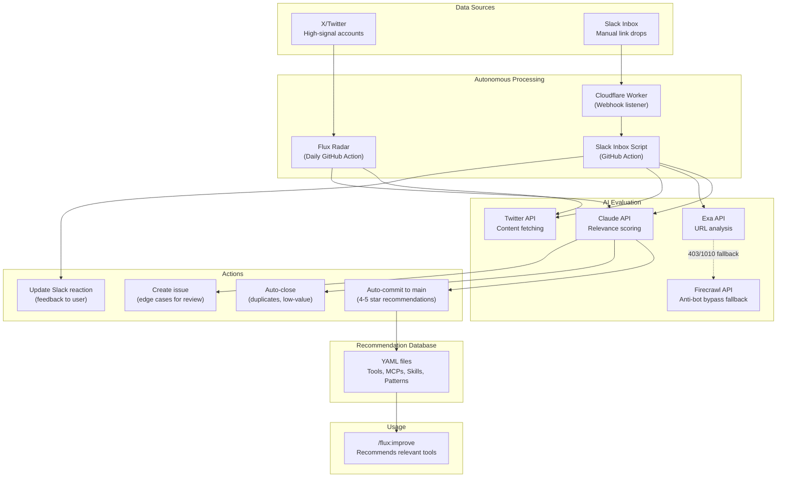

# Flux Recommendations

Curated database of workflow optimizations for AI-augmented development.

Used by [`/flux:improve`](https://github.com/Nairon-AI/flux) to recommend tools, plugins, and patterns.

## Why This Exists

The AI tooling landscape evolves faster than any human can track. New tools, MCPs, plugins, and patterns emerge daily on X/Twitter, YouTube, and GitHub. Keeping up manually means:

- **1-2 hours/day doom-scrolling X** looking for useful tools
- **Testing and verifying** what each tool actually does
- **Evaluating relevance** to your workflow
- **Writing documentation** for things worth keeping
- **Missing things** because you were sleeping or working

This repo solves that. It's an **always-on autonomous engine** that monitors, evaluates, and ingests the best AI development tools so they're ready when you need them. You stay up-to-date with zero effort, no matter how fast the industry moves.

## Architecture



**How it flows:**

1. **Flux Radar** runs daily, monitoring curated X accounts for AI tool announcements
2. **Slack Inbox** accepts manual link drops via Cloudflare Worker webhook
3. **AI evaluates** each item: Is it useful? Is it a duplicate? What category?
4. **High-confidence items** get auto-committed as recommendation YAMLs
5. **Low-value items** get auto-closed with reasoning
6. **`/flux:improve`** pulls from this database to recommend relevant tools

The result: A constantly-growing, AI-curated database of the best development tools, ready to surface exactly when you need them.

## Categories

| Folder | Subfolders | Description |
|--------|------------|-------------|
| `mcps/` | `design/`, `search/`, `productivity/`, `dev/`, `browser/` | Model Context Protocol servers |
| `cli-tools/` | `linting/`, `git/`, `terminal/`, `tasks/`, `agent-workflow/`, `communication/`, `frontend/`, `security/`, `testing/`, `review/`, `system/` | Command-line tools |
| `applications/` | `individual/`, `collaboration/`, `developer/`, `frameworks/` | Desktop/native apps and app-building stacks |
| `skills/` | `frontend/`, `research/`, `backend/`, `codebase-mapping/`, `marketplaces/`, `marketing/`, `writing/`, `meta-learning/`, `security/`, `specification/` | Standalone skills |
| `plugins/` | *(root)* | Claude Code plugins |
| `workflow-patterns/` | `git/`, `testing/`, `ai/`, `review/`, `recipes/` | Best practices (not tools) |
| `models/` | *(flat)* | Model guidance and model hubs |
| `model-evaluations/` | *(flat)* | 3-day model capability reports from X/Twitter signals |

## Contributing

Anyone can submit a PR! We have an AI slop detector that automatically triages low-quality submissions.

See [CONTRIBUTING.md](CONTRIBUTING.md) for guidelines. Each recommendation is a YAML file following [schema.yaml](schema.yaml).

---

## How `/flux:improve` Works

1. User runs `/flux:improve`
2. Flux analyzes their environment (repo, MCPs, sessions)
3. Fetches recommendations from this repo
4. Claude determines relevance for each recommendation
5. User selects which to install
6. Flux installs and verifies

## Flux Radar (Fully Autonomous)

This repo continuously improves itself. The **Flux Radar** runs daily via GitHub Actions and requires **zero human input**:

1. **Monitors** high-signal X/Twitter accounts (AI developers, tool makers, thought leaders)
2. **Validates** tweets against existing recommendations → adds social proof mentions
3. **Evaluates** unmatched tweets with AI → determines if they're about valuable NEW tools
4. **Auto-creates** recommendation YAMLs for genuinely useful discoveries
5. **Discards** low-value tweets (general chat, opinions, low engagement)
6. **Auto-commits** directly to main

**Criteria for new tool discovery:**
- 50+ likes (engagement signal)
- Specific tool/MCP/CLI/plugin/skill/pattern (not vague advice)
- Relevant to AI-assisted development
- Actionable (has install method, homepage, etc.)

The radar ingests useful data from high-intent signals on X, so the recommendation database grows smarter every day without manual curation.

## Slack Inbox (Fully Autonomous)

Drop any link into the Flux Inbox Slack channel → AI evaluates and acts:

| Verdict | Action | Slack Reaction |
|---------|--------|----------------|
| **Yes (4-5 stars)** | Auto-creates recommendation YAML, commits to main | :white_check_mark: |
| **Duplicate** | Auto-closes with explanation | :x: |
| **No / Low value** | Discards silently | :x: |
| **Maybe** | Creates issue for rare human review | :thinking_face: |

Supports: Tweets, X articles, YouTube videos, GitHub repos, articles, any URL.

**Cloudflare bypass:** Some websites block bot requests with Cloudflare's Browser Integrity Check (error 1010). When Exa API fails with 403/1010, the system automatically falls back to Firecrawl, which can bypass these protections.

This leaves room for manual discovery - if you spot something useful while browsing, just drop the link. The system handles everything else.

### Reviewing "Maybe" Items

When something gets a :thinking_face: reaction, an issue is created for human review. You can review it directly via GitHub issue comments:

**To approve** (commits the recommendation):
- "approve", "lgtm", "good to go", "add it", "ship it", "yes"

**To reject** (closes the issue):
- "reject", "close", "deny", "not good", "skip", "no", "pass"

The workflow automatically:
1. Extracts the proposed YAML from the issue body
2. Commits it to the appropriate folder
3. Closes the issue with the outcome
4. Adds a reaction to your comment (👍 or 👎)

Only users with write access to the repository can approve or reject.

## Cost of Automation

Running this fully autonomous system costs approximately:

| Component | Daily | Monthly |
|-----------|-------|---------|
| Flux Radar (tweet monitoring + AI eval) | ~$0.25 | ~$7.50 |
| Slack Inbox (link processing) | ~$0.05 | ~$1.50 |
| Twitter API (TwitterAPI.io) | ~$0.20 | ~$6.00 |
| Exa API (URL expansion + tool verification) | ~$0.05 | ~$1.50 |
| Firecrawl API (anti-bot fallback) | ~$0.02 | ~$0.60 |
| **Total** | **~$0.57/day** | **~$17.10/month** |

**What you're actually paying for:**

This isn't about saving money on API calls. It's about **buying back your time and attention**:

- **No more doom-scrolling X** hunting for the next useful tool
- **No more FOMO** about missing important releases while you sleep
- **No more manual evaluation** of whether a tool is worth trying
- **No more context-switching** between "discovery mode" and "build mode"
- **Stay current automatically** no matter how fast the industry evolves

**The math:**
- Manual equivalent: 1-2 hours/day monitoring X, testing tools, writing YAMLs
- At $50/hr = **$1,500-3,000/month** of human time
- **ROI: 100-200x** - sleep at night while the database grows itself

The system pays for itself if it saves you **18 minutes per month**. In practice, it saves hours.

## Model Evaluation Radar

`scripts/model-eval-radar.py` monitors AI lab release announcements and runs a 3-day collection window:

1. Detects release tweets from labs (`@AnthropicAI`, `@OpenAI`, `@GoogleAI`, etc.)
2. Collects monitored-account and high-engagement discovery tweets for each model
3. Generates structured reports in `model-evaluations/`

Run manually:

```bash
TWITTER_API_KEY=... python3 scripts/model-eval-radar.py
```

Or use `.github/workflows/model-eval-radar.yml` for daily automation.

## Community

Join the most AI-native developer community on the planet. No hype. No AI slop. Just practical discussions on becoming the strongest developers alive.

AI-slop pull requests are automatically triaged and closed.

[discord.gg/CEQMd6fmXk](https://discord.gg/CEQMd6fmXk)

## License

MIT
